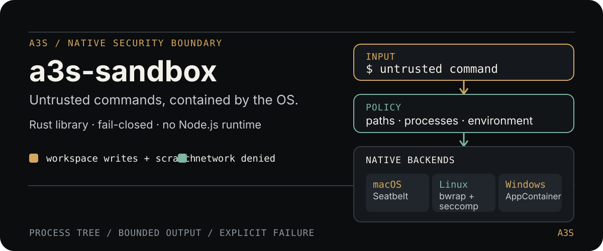

# A3S Sandbox

<p align="center">
  
</p>

<p align="center">
  <a href="https://github.com/A3S-Lab/Sandbox/actions/workflows/ci.yml"></a>
  <a href="https://github.com/A3S-Lab/Sandbox/blob/main/LICENSE"></a>
  <a href="https://github.com/A3S-Lab/Sandbox/releases"></a>
</p>

`a3s-sandbox` is a Rust-native, fail-closed command boundary for A3S Bash and
other A3S products. It turns an untrusted command into a bounded process tree
with explicit workspace, credential, environment, network, and lifecycle
limits enforced by the host operating system.

There is no Node.js runtime, npm package, or SRT process in the execution
path. The library is deliberately independent of A3S Code so it can be
embedded by a CLI, an agent, or a future SDK.

## Quick start

Add the library from GitHub. This is the tested Gate 0 revision; update it
intentionally when adopting a newer release:

```toml
[dependencies]
a3s-sandbox = { git = "https://github.com/A3S-Lab/Sandbox", rev = "09c46aaf18e4be2c881459fa71ece8a9d8c45283" }
```

Run a command through the native boundary:

```rust,no_run
use a3s_sandbox::NativeSandbox;

#[tokio::main]
async fn main() -> anyhow::Result<()> {
    let workspace = std::env::current_dir()?;
    let sandbox = NativeSandbox::new(workspace)?;

    // Fail before running a tool when the host cannot provide the boundary.
    sandbox.probe().await?;

    let output = sandbox.exec_command("echo inside sandbox").await?;
    println!("{}", output.stdout);
    Ok(())
}
```

`CommandOutput` contains separate `stdout` and `stderr`, an exit code, and a
`timed_out` flag. Captured output is bounded to 100 KiB, while an optional
`OutputObserver` can receive live deltas and final accounting.

## What is enforced now

The default A3S Bash profile is intentionally strict:

- network access and host Unix-domain sockets are denied;
- writes are limited to the canonical workspace and a private scratch
  directory;
- credentials, secret files, `.git`, `.a3s`, agent metadata, and shell/tool
  bootstrap files are protected;
- symbolic-link and hard-link escape paths are rejected;
- child environments are sanitized, temporary state is redirected, and shell
  injection variables are removed;
- deadlines terminate the complete descendant tree, and output capture stays
  bounded;
- a missing launcher, unavailable namespace, or failed capability probe returns
  an error instead of executing on the host.

These guarantees apply to the process tree, not only to the first shell.
Read the [security model](SECURITY.md) for the threat model, platform caveats,
and the exact protected paths.

## Native boundaries

| Host | Boundary | Host requirement |
| --- | --- | --- |
| macOS | Seatbelt profile plus process-group lifecycle | System `/usr/bin/sandbox-exec` |
| Linux | Bubblewrap user/mount/PID/IPC/UTS namespaces plus seccomp | `/usr/bin/bwrap` and an unprivileged user namespace |
| Windows | PowerShell 7 inside an AppContainer, restricted workspace ACLs, temporary drive, and kill-on-close Job Object | PowerShell 7 under system Program Files |
| Other targets | Explicit unsupported-platform error | No host fallback |

The backend is selected at compile time, while policy construction and command
output stay platform-neutral. Windows executions are serialized because
temporary ACL and device-map changes are shared process state; cleanup restores
the exact prior ACL state.

## Execution model

```text
CommandRequest
    │
    ├── canonical workspace + private scratch directory
    ├── sanitized environment + protected path set
    └── native backend
          ├── macOS  → Seatbelt
          ├── Linux  → Bubblewrap + seccomp
          └── Windows → AppContainer + Job Object
                    │
                    └── bounded CommandOutput + observer events
```

The policy layer is the single source of truth. Platform modules enforce its
decisions; they do not silently broaden them when a host feature is missing.

## Scope and roadmap

Gate 0—the complete A3S Bash baseline—is shipped and tested on macOS, Linux,
and Windows. The next stages add opt-in, mediated HTTP/HTTPS and SOCKS5
networking, Unix-socket policy, TLS handling, dynamic policy snapshots,
structured violation monitoring, nested-sandbox negotiation, and release
migration tooling.

See [ROADMAP.md](ROADMAP.md) for the capability matrix, staged delivery plan,
acceptance gates, cross-architecture test matrix, and security-release risks.

The goal is SRT-level security outcomes and controls with an A3S-owned Rust
API—not a line-for-line clone of SRT's internal TypeScript implementation.

## Development

Install the platform prerequisites, then run the same gates used by CI:

```bash
cargo fmt --all -- --check
cargo clippy --all-targets -- -D warnings
cargo test --all-targets
```

The CI matrix covers `ubuntu-latest`, `macos-14`, and `windows-latest`.
Security-sensitive changes should include a negative test proving that a
denied operation cannot reach the host through a descendant, inherited handle,
environment variable, symlink, hard link, socket, or alternate network path.

## License

MIT
